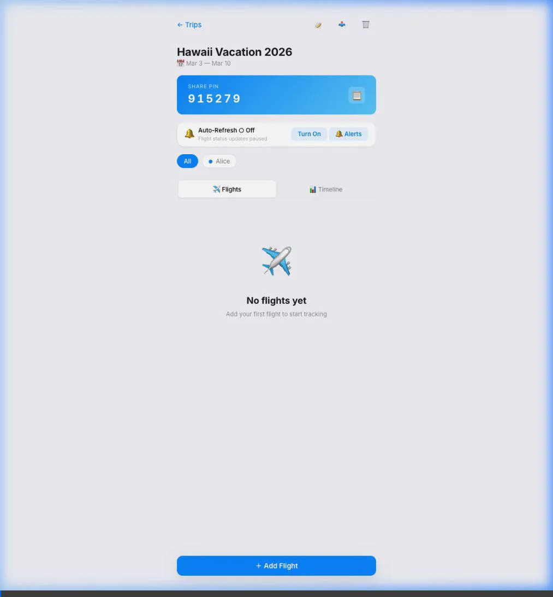
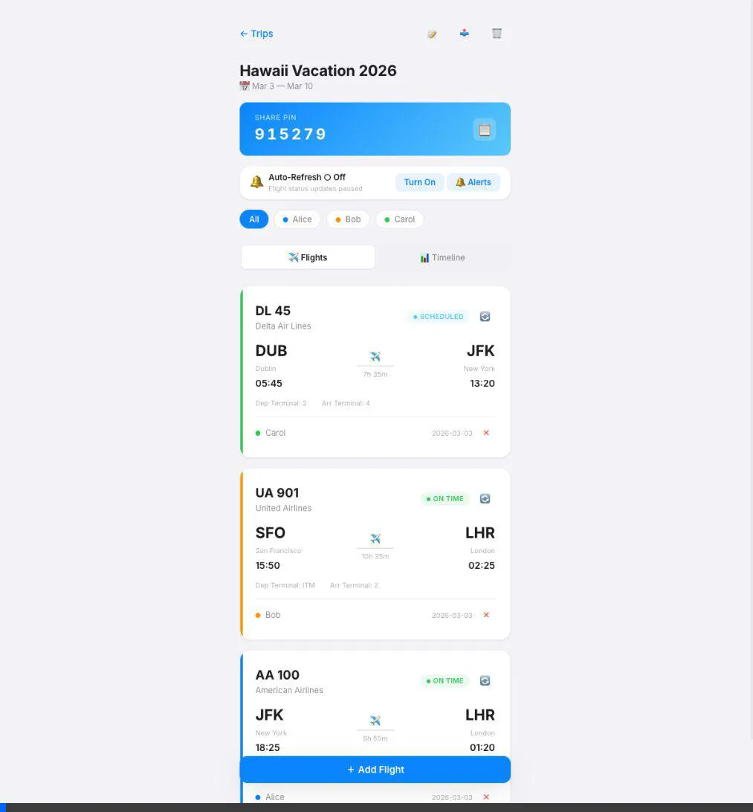

<h1 align="center">PPC: Delay No More ✈️</h1>

<p align="center">
  A collaborative, real-time Progressive Web App (PWA) for syncing group travel plans, coordinating multi-leg itineraries, and receiving native Web Push delay alerts.
</p>

---

## 📸 App Demo

### 1. Group Itinerary Coordination & Auto-Lookup
<p align="center">
  
</p>

*The proprietary **Coordination Engine** analyzes everyone's home airports and finds the best overlapping flights. Then, it uses the **AeroDataBox API** to automatically pull real-world flight numbers, times, and gates.*

### 2. Auto-Fill Flight Metadata
<p align="center">
  
</p>

*Manually typing flights is a chore. Look up flights by number (e.g. AA100) — the app auto-fills airline, airports, times, and duration.*


### 2. Live Dashboard & Interactive Timeline
<p align="center">
  
</p>

*View all inbound and outbound flights at a glance, filter by traveler, and switch to the interactive, scrollable timeline to visually see how flights overlap across the group.*

---

## ✨ Features Built Over 5 Phases

- **Multi-User Sync (Phase 1)**: Powered by a Supabase PostgreSQL backend, data instantly syncs across devices for all travelers in the group.
- **Auto Flight Lookup (Phase 2)**: Just type a flight number (e.g. `AA100`). The app queries the AeroDataBox API to auto-fill airline, airports, times, and durations.
- **Robust Web Push Alerts (Phase 5)**: Instead of draining your battery with client-side polling, a **Supabase Edge Function** wakes up every 15 minutes, checks RapidAPI, and dispatches native OS-level **Web Push Notifications** directly to your device's Service Worker if a flight gets delayed or cancelled.
- **AI Coordination Engine (Phase 4)**: Enter your group's destination, start date, and end date. The web app queries **SerpAPI Google Flights** to find optimal overlapping inbound and outbound legs for every participant based on their home airport, complete with pricing and duration. 
- **Live Calendar Subscription**: Generate a secure, personalized `webcal://` link for your trip. Subscribe on Apple Calendar, Google, or Outlook to get live, auto-updating flight blocks right on your daily itinerary.
- **PIN-Based Sharing & Safety**: Trips are secured by a short, auto-generated PIN (e.g. `1492`). Share the pinned link via Whatsapp or SMS, and friends can instantly join. Strict database policies allow users to securely delete their own profiles and flights if plans change without affecting others.
- **Shared Notes**: Keep a collaborative scratchpad of hotel bookings, meetup spots, and rental car info right next to the flight statuses.
- **PWA Ready**: Install the app directly to your iOS or Android home screen for a native-like app experience.

---

## 🛠️ Technology Stack

- **Frontend**: Vanilla JavaScript + HTML5. Modern, dependency-free UI architecture built entirely from scratch.
- **Styling**: Hand-crafted CSS using CSS Variables, modern flexbox/grid layouts, and sleek micro-animations. Glassmorphism UI with vibrant dynamic colors.
- **Backend & Database**: [Supabase](https://supabase.com) (PostgreSQL + REST API)
- **Edge Functions**: Deno + Web Push API (`npm:web-push`)
- **APIs**: 
  - [AeroDataBox API](https://aerodatabox.com/) (Live Flight Status Tracker)
  - [SerpAPI Google Flights](https://serpapi.com/) (Flight Schedule Lookups)
- **Build Tool**: [Vite](https://vitejs.dev/) with `vite-plugin-pwa`
- **Hosting**: [Vercel](https://vercel.com/)

---

## 🚀 Local Development

### Prerequisites
- Node.js (v20+)
- A [Supabase](https://supabase.com) Account
- RapidAPI and SerpAPI Keys

### 1. Database Setup
Create an empty Supabase project. In the **SQL Editor**, run the contents of `supabase_schema.sql` (and the `supabase/migrations/` folder) to generate the tables (`trips`, `participants`, `flights`, `notes`, `push_subscriptions`) and their Row Level Security (RLS) policies.

### 2. Environment Variables
Clone the repository and copy the environment template:
```bash
cp .env.example .env
```
Fill in `.env` with your actual keys (including the VAPID keys you must generate using `npx web-push generate-vapid-keys`):
```env
VITE_SUPABASE_URL=https://your-project.supabase.co
VITE_SUPABASE_ANON_KEY=sb_publishable_your_key_here
VITE_RAPIDAPI_KEY=your_rapidapi_key_here
VITE_SERPAPI_KEY=your_serp_key
VITE_VAPID_PUBLIC_KEY=your_vapid_public_key
```

*Note: You must also run `npx supabase secrets set --env-file .env` and deploy the Edge Function to your Supabase cloud environment for notifications to work locally.*

### 3. Run the App
```bash
npm install
npm run dev
```
The app will be available at `http://localhost:5173`. Make edits to the `src/` folder — Vite will hot-reload your changes instantly!

---

## 📝 License

This project is licensed under the MIT License. Feel free to use, modify, and distribute as you see fit.
