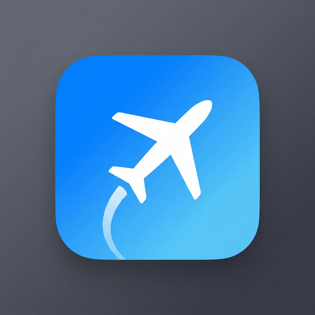
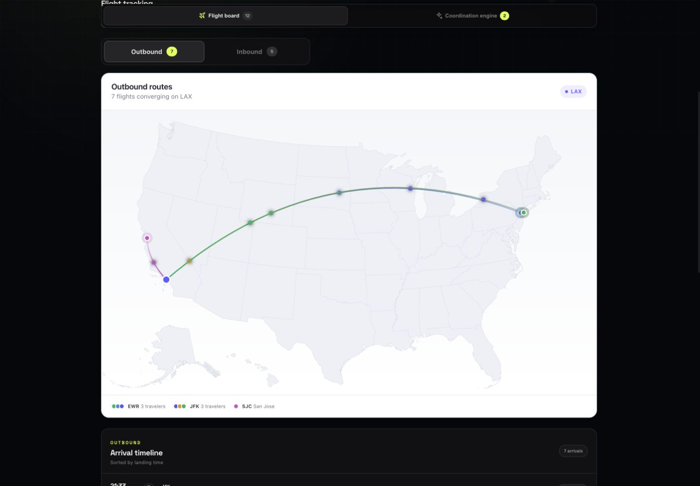
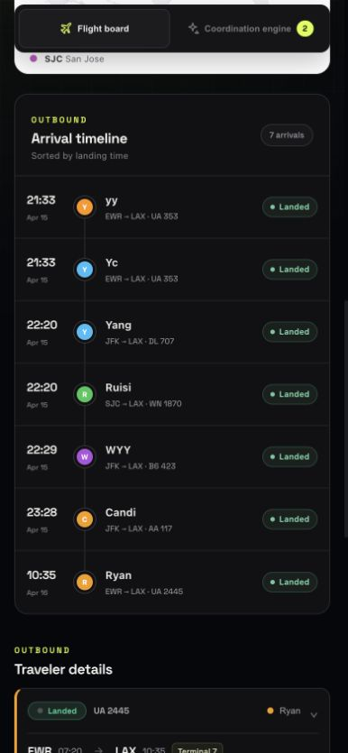
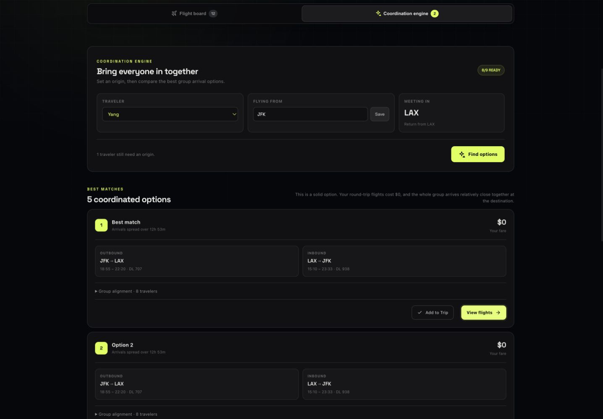
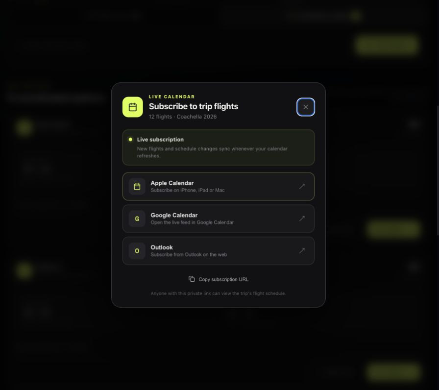

<div align="center">
  
  <h1>PPC: Delay No More</h1>
  <p><strong>One shared flight dashboard for the whole trip.</strong></p>
  <p>Track every traveler, compare arrival times, coordinate missing flights, and keep the group moving without spreadsheets or message-thread chaos.</p>
  <p><a href="https://ppc-tripflights.vercel.app/">Open the live app →</a></p>
</div>

## How it works

1. **Create or join a trip** with a six-digit invitation PIN.
2. **Add each traveler's flights** and keep the shared board up to date.
3. **Use the map, timeline, and coordination engine** to see when everyone arrives and what still needs attention.

## Flight board

The main board brings the entire trip into one view:

- Filter by traveler or switch between outbound and inbound flights.
- Follow every route on a shared animated map.
- See group readiness, landed travelers, arrival spread, and missing bookings at a glance.
- Refresh live flight status without opening every airline website.



## Arrival timeline & traveler details

Flights are sorted by landing time so the group can immediately see who arrives first, who lands next, and how far apart the arrivals are. Each traveler card expands to show route, local times, status, gate, and arrival terminal.

<p align="center">
  
</p>

## Coordination engine

The coordination engine focuses on the people who are not fully booked yet. Choose a traveler and origin airport, then compare round-trip options against the rest of the group's arrival pattern. Matching flights can be reviewed and added back to the shared trip.



## Live calendar subscription

Subscribe once from Apple Calendar, Google Calendar, or Outlook. The calendar feed reads the latest shared flight information—including schedule, status, route, traveler, and terminals—whenever the calendar provider refreshes it.

<p align="center">
  
</p>

## Built for group travel

- **Shared by default:** everyone in the trip sees the same flights and traveler list.
- **Fast on mobile:** compact controls, clear status labels, and expandable cards work well at the airport.
- **Installable PWA:** add PPC to a phone or desktop for app-like access.
- **Private trip link:** access stays behind the trip PIN and its private calendar subscription URL.

## Run locally

```bash
git clone https://github.com/yangwy30/ppc-tripflights.git
cd ppc-tripflights
npm install
cp .env.example .env
npm run dev
```

Copy `.env.example` to `.env`, then add the Supabase project values used by your deployment.

### Stack

Vite · Supabase · React · React Simple Maps · PWA
