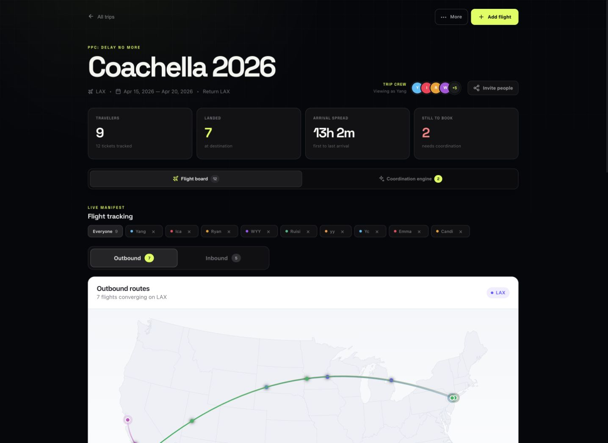
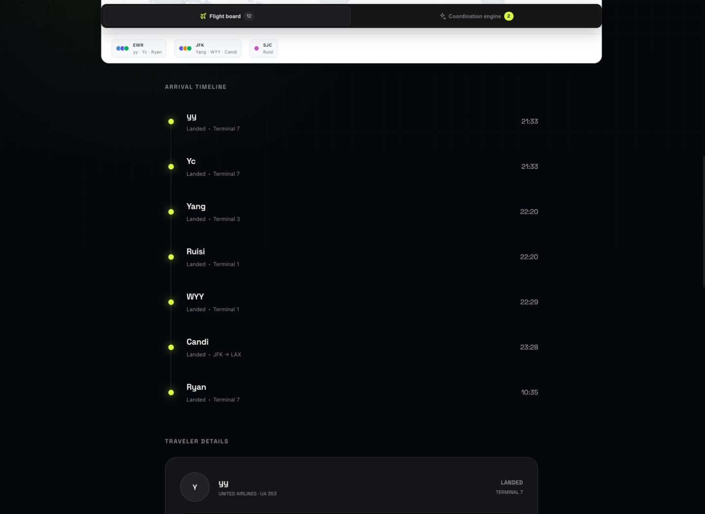
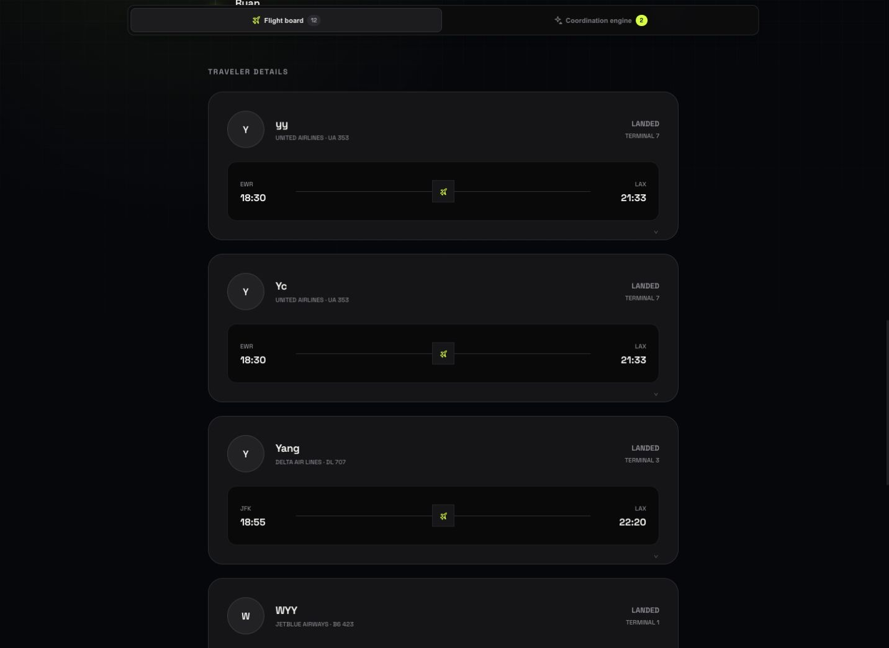
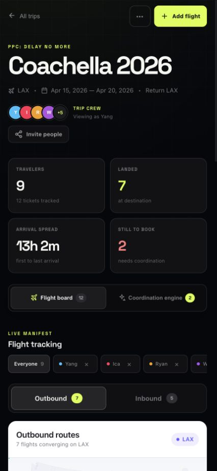
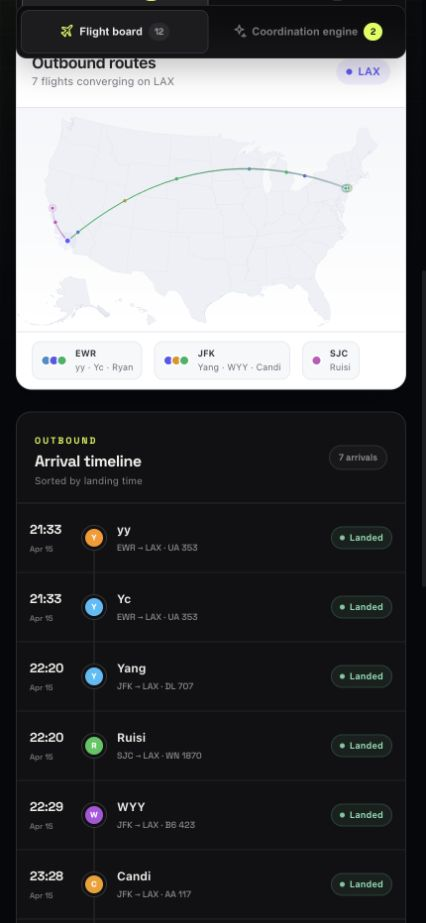
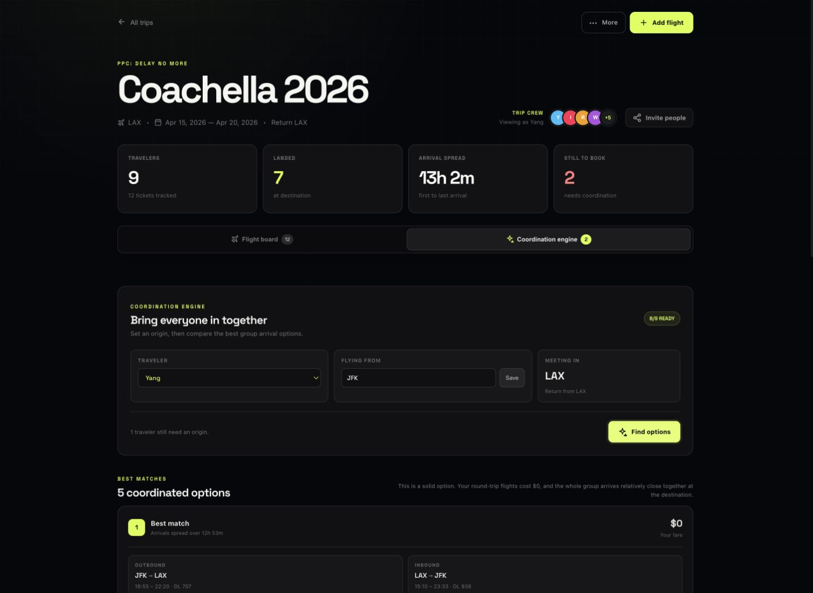

<div align="center">
  
  <h1>PPC: Delay No More</h1>
  <p><strong>One trip. Every traveler. Every flight—finally in sync.</strong></p>
  <p>A live arrival board and AI flight coordinator for groups traveling from different cities.</p>

  <a href="https://ppc-tripflights.vercel.app/">
    
  </a>

  <br /><br />

  
  
  
</div>

<br />


## One shared view for the whole trip

PPC replaces confirmation screenshots, spreadsheets, and group-chat check-ins with one live command center. Everyone can see who is flying, where they are coming from, when they land, and who still needs a plan.



<table>
  <tr>
    <td width="50%"><strong>✈️ Shared flight board</strong><br />Outbound and inbound flights for the entire crew.</td>
    <td width="50%"><strong>🗺️ Live route map</strong><br />Animated routes, grouped origins, and traveler names.</td>
  </tr>
  <tr>
    <td width="50%"><strong>⏱️ Arrival timeline</strong><br />A clear landing order with live status and arrival terminals.</td>
    <td width="50%"><strong>🎫 Traveler details</strong><br />Expandable cards for routes, local times, airlines, gates, and terminals.</td>
  </tr>
</table>

## Built around arrivals—not a spreadsheet

The flight board follows the way a group actually thinks. The timeline answers <em>who lands next?</em>, while traveler cards keep the route and operational details one tap away.





## Designed for the phone in your hand

<table>
  <tr>
    <td width="50%" align="center">
      
    </td>
    <td width="50%" align="center">
      
    </td>
  </tr>
  <tr>
    <td align="center"><sub>Know whether the crew is ready.</sub></td>
    <td align="center"><sub>Know who lands next—and where.</sub></td>
  </tr>
</table>

## AI coordination with live Google Flights results

The Coordination Engine searches current options from **Google Flights**, compares them with flights the group has already booked, and scores combinations by arrival overlap, return timing, stops, and price. **Gemini AI** then explains the strongest match in plain language—including the tradeoffs—before anything is added to the trip.

<table>
  <tr>
    <td width="33%"><strong>1 · Search</strong><br />Pull current routes and prices from Google Flights.</td>
    <td width="33%"><strong>2 · Coordinate</strong><br />Find the best overlap for travelers leaving from different airports.</td>
    <td width="33%"><strong>3 · Explain</strong><br />Use Gemini AI to summarize the best option and its timing.</td>
  </tr>
</table>



## One simple flow

1. **Create a trip** and choose the shared destination and dates.
2. **Invite the crew** with a private link or six-digit PIN.
3. **Add known flights** through guided lookup or manual entry.
4. **Coordinate missing flights** with AI and live Google Flights options.
5. **Follow the trip** through the map, arrival timeline, traveler cards, and calendar.

## Quietly powerful

- **Smart flight refresh** runs automatically around the active trip and stops after it ends.
- **Live calendar subscription** works with Apple Calendar, Google Calendar, and Outlook.
- **Arrival terminals and gates** stay attached to each traveler and flight.
- **Shared trip notes** keep hotels, meetup points, and ground transportation beside the itinerary.
- **Commercial airport search** only suggests airports with current scheduled airline service.
- **Installable PWA** makes the dashboard feel at home on mobile and desktop.

## Run locally

```bash
git clone https://github.com/yangwy30/ppc-tripflights.git
cd ppc-tripflights
npm install
cp .env.example .env
npm run dev
```

Add the Supabase project values to `.env`. Google Flights search runs through the `search-flights` Edge Function with `SERPAPI_KEY` stored as a Supabase secret; Gemini summaries use `VITE_GEMINI_API_KEY`.

<div align="center">
  <sub>Vite · Supabase · Google Flights · Gemini AI · React Simple Maps · Progressive Web App</sub>
</div>
