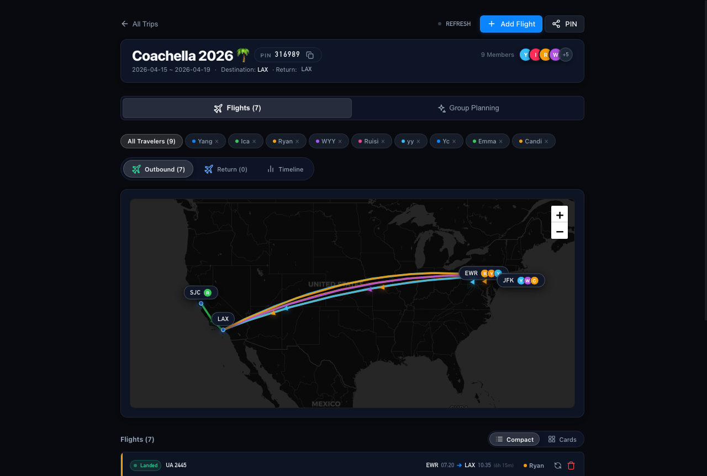
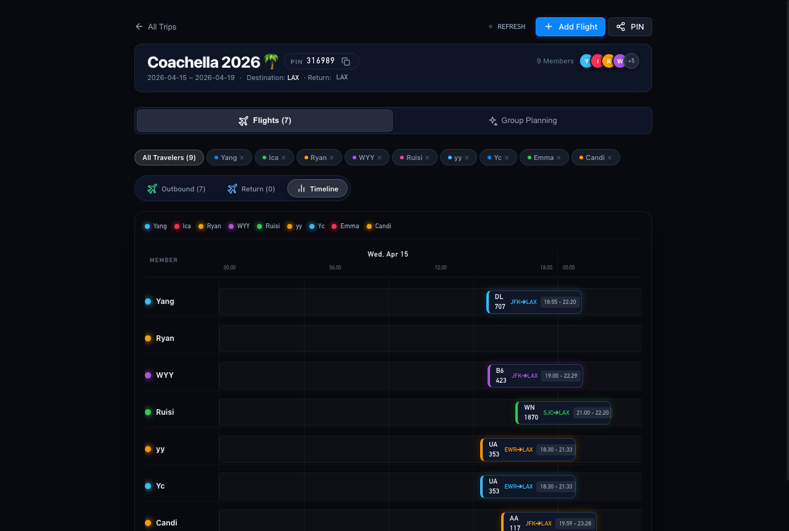
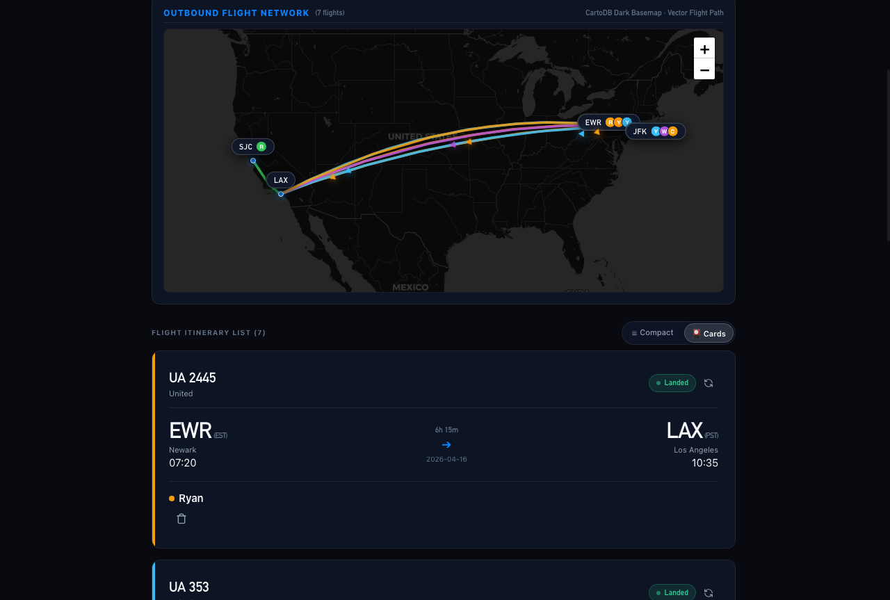
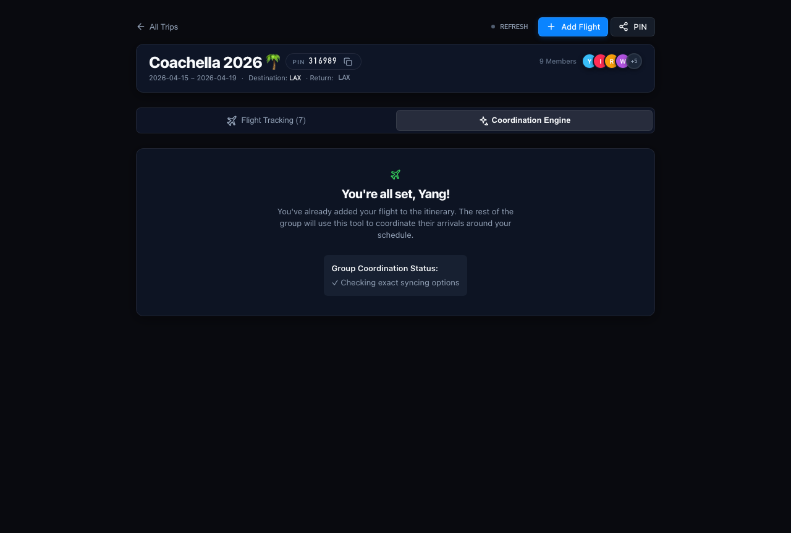
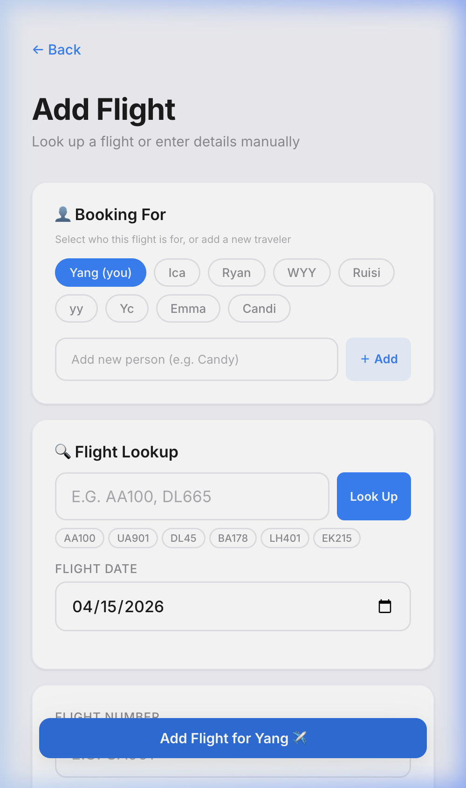

<h1 align="center">PPC: Delay No More ✈️</h1>

<p align="center">
  <b>State-of-the-Art Apple Flighty Dark Minimalist Group Flight Tracker & AI Coordination Engine</b>
</p>

<p align="center">
  A collaborative, real-time Progressive Web App (PWA) for syncing group travel plans, visualizing flight networks on interactive Leaflet maps, organizing timelines, and receiving native Web Push delay alerts.
</p>

---

## 📸 Real Web App Showcase

> Live browser captures from a **Coachella 2026** group trip — 9 travelers (Yang, Ica, Ryan, WYY, Ruisi, yy, Yc, Emma, Candi), 12 flights across JFK, EWR, SJC ➔ LAX.

### 1. Interactive Geodesic Flight Route Network & Dashboard

<p align="center">
  
</p>

*Live capture of the **Dashboard & Hero Route Map**. Powered by CartoDB Dark Retina basemaps, displaying neon geodesic flight arcs color-coded by traveler, dynamic collision avoidance airport markers, shareable PIN code (`316989`), and member avatar stacks.*

---

### 2. Apple Flighty SOTA Timeline Engine

<p align="center">
  
</p>

*Live capture of the **Apple Flighty-inspired Glassmorphic Timeline**. Features 100% physical left/right alignment to local departure/arrival wall-clock times, 4px left color accent ribbons, and integrated flight capsules (`DL 707`, `WN 1870`, `B6 423`, `UA 353`).*

---

### 3. Compact & Expanded Flight Itinerary Cards

<p align="center">
  
</p>

*Live capture of the **Flight Cards Stream**. Displays flight details for UA 2445, UA 353, DL 707, local timezone indicators (`EST`, `PST`), duration, airline branding, and dynamic status badges (`● Landed`, `● Scheduled`).*

---

### 4. Group Travel Coordination Engine

<p align="center">
  
</p>

*Live capture of the **Coordination Engine**. Analyzes origin airports for all group members and suggests optimal arrival proximity schedules.*

---

### 5. Auto-Fill Flight Lookup

<p align="center">
  
</p>

*Live capture of the **Add Flight Form**. Automatically queries AeroDataBox API to auto-fill airline, departure/arrival airports, times, terminals, and aircraft info.*

---

## ✨ Key Features & Architecture

- **SOTA Apple Dark Glassmorphic UI**: Slate dark aesthetics, precision typography, 60fps constant-velocity geodesic map animation, and zero-clipping floating capsules.
- **Universal Local Wall-Clock Grid**: Timeline grid aligns 100% to local departure and arrival times without timezone distortion.
- **Multi-User Real-Time Sync**: Powered by Supabase PostgreSQL backend, data instantly syncs across devices for all group travelers.
- **Auto Flight Lookup**: Type any flight number (e.g. `AA100`, `DL707`). The app queries AeroDataBox API to auto-fill airline, airports, terminals, times, and durations.
- **Native Web Push Delay Alerts**: Powered by Supabase Edge Functions checking RapidAPI every 15 minutes to deliver native OS-level delay alerts.
- **Live Calendar Subscription**: Generate a secure `webcal://` link to subscribe on Apple Calendar, Google Calendar, or Outlook.
- **PIN-Based Sharing & Security**: Trips secured by 6-digit PIN code (`316989`). Share via WhatsApp or SMS.
- **PWA Ready**: Install directly to iOS/Android home screen for a full native app experience.

---

## 🛠️ Technology Stack

- **Frontend**: Vanilla JavaScript (ES Modules) + HTML5 + CSS Variables
- **Map Engine**: Leaflet.js + CartoDB Dark Retina Basemaps + Custom Haversine Geodesic Arc Interpolator
- **Backend & Database**: [Supabase](https://supabase.com) (PostgreSQL + REST API)
- **Edge Functions**: Deno + Web Push API (`web-push`)
- **Live APIs**: 
  - AeroDataBox API (Live Flight Tracking)
  - SerpAPI Google Flights (Group Schedule Coordination)
- **Build Tool**: Vite 4 + `vite-plugin-pwa`
- **Hosting**: Vercel

---

## 🚀 Local Development

```bash
# Clone the repository
git clone https://github.com/yangwy30/ppc-tripflights.git
cd ppc-tripflights

# Install dependencies
npm install

# Start development server
npm run dev

# Build for production
npm run build
```
