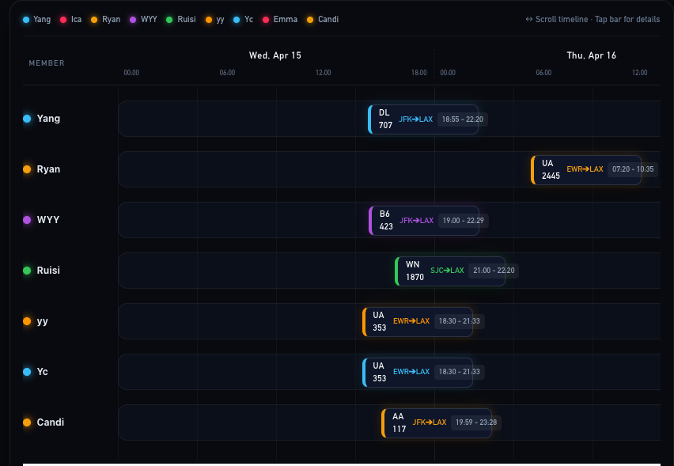
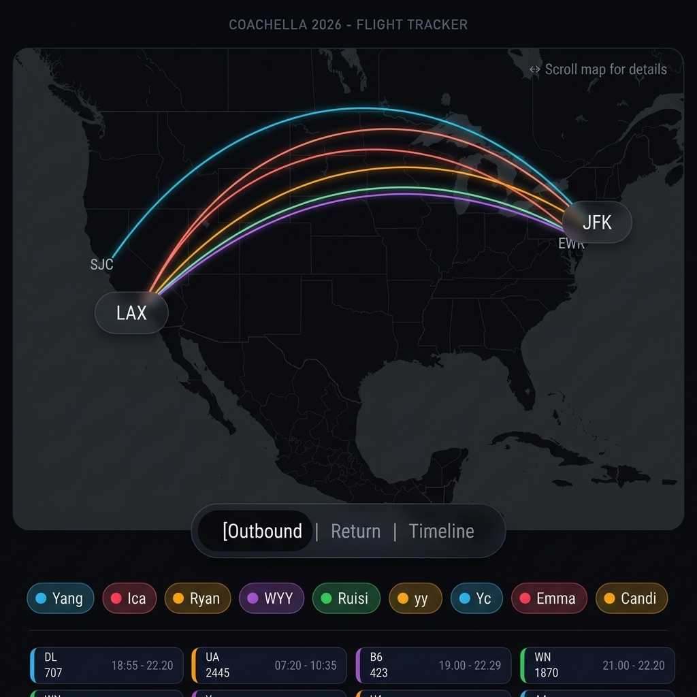
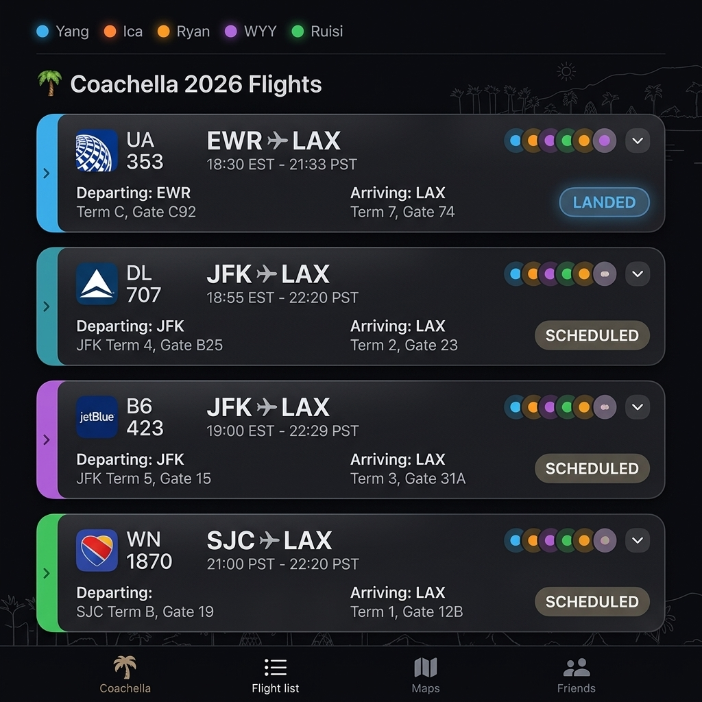
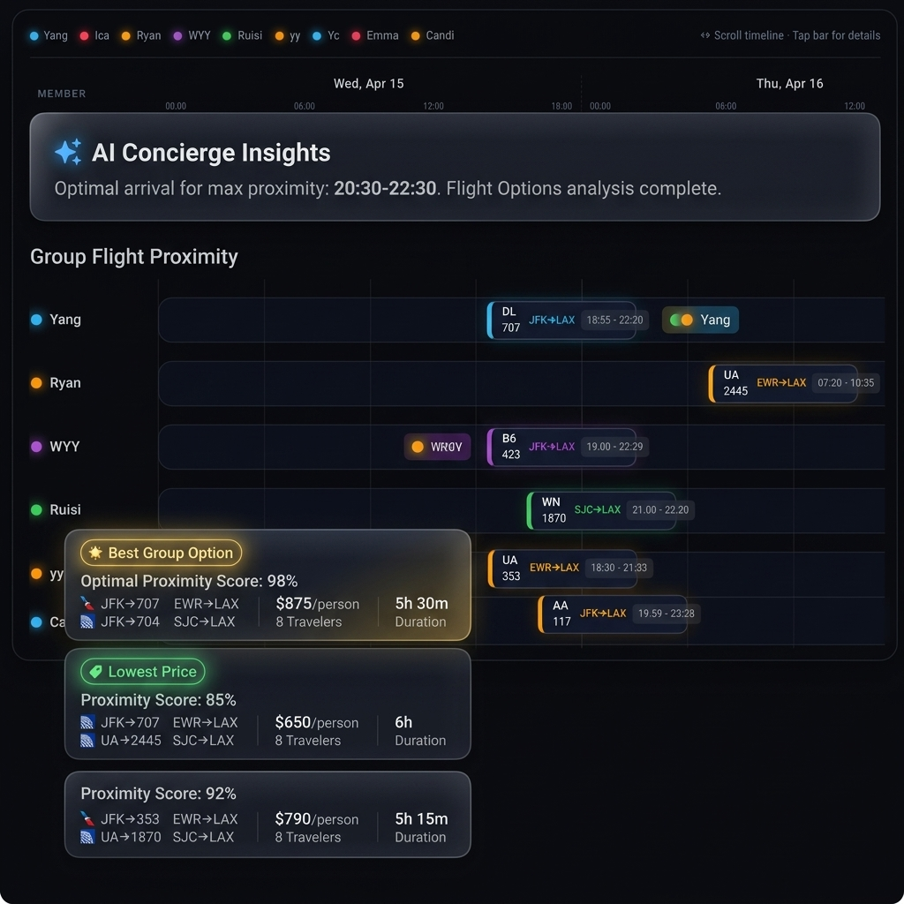

<h1 align="center">PPC: Delay No More ✈️</h1>

<p align="center">
  <b>State-of-the-Art Apple Flighty Dark Minimalist Group Flight Tracker & AI Coordination Engine</b>
</p>

<p align="center">
  A collaborative, real-time Progressive Web App (PWA) for syncing group travel plans, visualizing flight networks on interactive Leaflet maps, organizing timelines, and receiving native Web Push delay alerts.
</p>

---

## 📸 State-of-the-Art App Showcase

> Real-time data from a **Coachella 2026** group trip — 9 travelers (Yang, Ica, Ryan, WYY, Ruisi, yy, Yc, Emma, Candi), 12 flights across JFK, EWR, SJC ➔ LAX.

### 1. SOTA Timeline Engine (Flighty 3.0 Glassmorphism)

<p align="center">
  
</p>

*The flagship **Apple Flighty-inspired Timeline Engine**. Features a `#090A0F` dark slate backdrop, `backdrop-filter: blur(12px)` glassmorphic capsules, and 4px traveler-specific color ribbons. Departure and arrival positions are 100% physically aligned to local wall-clock times, with integrated flight badges (`DL 707`, `WN 1870`) and routes (`JFK➔LAX`, `SJC➔LAX`) neatly enclosed inside.*

---

### 2. Interactive Geodesic Flight Route Network

<p align="center">
  
</p>

*Hero flight network built with **CartoDB Dark Retina tiles**. Displays neon geodesic curved flight arcs color-coded by traveler (Cyan, Coral, Gold, Violet, Mint Green). Clean glassmorphic airport markers with zero emojis automatically calculate dynamic collision offsets.*

---

### 3. Flight Itinerary Cards & Real-Time Status

<p align="center">
  
</p>

*Clean compact flight cards featuring left accent ribbons, traveler avatars, local timezone badges (`EST`, `PST`), terminal/gate info, and live status badges (`● Landed`, `● Scheduled`) dynamically evaluated against local arrival times.*

---

### 4. AI Group Coordination Engine

<p align="center">
  
</p>

*AI-powered group coordination engine analyzes participants' home airports and calculates optimal overlapping flight options scored by arrival proximity, price, and duration.*

---

## ✨ Key Features & Architecture

- **SOTA Apple Dark Glassmorphic UI**: Slate dark aesthetics, precision typography, 60fps constant-velocity geodesic map animation, and zero-clipping floating capsules.
- **Universal Local Wall-Clock Grid**: Timeline grid aligns 100% to local departure and arrival times without timezone distortion.
- **Multi-User Real-Time Sync**: Powered by Supabase PostgreSQL backend, data instantly syncs across devices for all group travelers.
- **Auto Flight Lookup**: Type any flight number (e.g. `AA100`, `DL707`). The app queries AeroDataBox API to auto-fill airline, airports, terminals, times, and durations.
- **Native Web Push Delay Alerts**: Powered by Supabase Edge Functions checking RapidAPI every 15 minutes to deliver native OS-level delay alerts.
- **Live Calendar Subscription**: Generate a secure `webcal://` link to subscribe on Apple Calendar, Google Calendar, or Outlook.
- **PIN-Based Sharing & Security**: Trips secured by 6-digit PIN code (`897952`). Share via WhatsApp or SMS.
- **PWA Ready**: Install directly to iOS/Android home screen for a full native app experience.

---

## 🛠️ Technology Stack

- **Frontend**: Vanilla JavaScript (ES Modules) + HTML5 + CSS Variables
- **Map Engine**: Leaflet.js + CartoDB Dark Retina Basemaps + Custom Haversine Geodesic Arc Interpolator
- **Backend & Database**: [Supabase](https://supabase.com) (PostgreSQL + REST API)
- **Edge Functions**: Deno + Web Push API (`web-push`)
- **Live APIs**: 
  - AeroDataBox API (Live Flight Tracking)
  - SerpAPI Google Flights (Group Schedule Coordination)
- **Build Tool**: Vite 4 + `vite-plugin-pwa`
- **Hosting**: Vercel

---

## 🚀 Local Development

```bash
# Clone the repository
git clone https://github.com/yangwy30/ppc-tripflights.git
cd ppc-tripflights

# Install dependencies
npm install

# Start development server
npm run dev

# Build for production
npm run build
```
