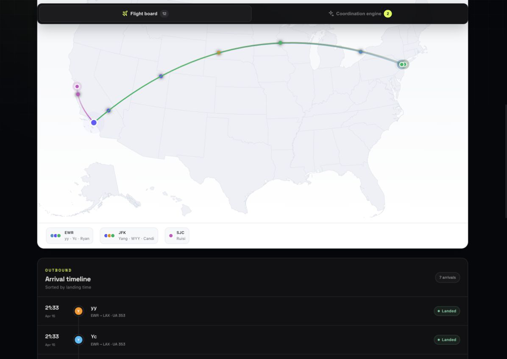

<div align="center">
  
  <h1>PPC: Delay No More</h1>
  <p><strong>One trip. Every traveler. Every flight—finally in sync.</strong></p>
  <p>A shared flight command center for groups arriving from different cities.</p>

  <a href="https://ppc-tripflights.vercel.app/">
    
  </a>

  <br /><br />

  
  
  
</div>

<br />


## See the trip move



<p align="center"><sub>Real product UI from the live app—no mock screens.</sub></p>

## The whole trip, at a glance

PPC replaces scattered confirmations, spreadsheets, and group-chat check-ins with one live view of the journey. See who is flying, where everyone is, when they land, and who still needs a plan.


<table>
  <tr>
    <td width="50%"><strong>✈️ Shared flight board</strong><br />Every traveler's outbound and inbound flights in one place.</td>
    <td width="50%"><strong>🗺️ Live route map</strong><br />Animated routes, grouped origins, and traveler names at every airport.</td>
  </tr>
  <tr>
    <td width="50%"><strong>⏱️ Arrival intelligence</strong><br />Landing order, arrival spread, flight status, gates, and terminals.</td>
    <td width="50%"><strong>🧠 Coordination engine</strong><br />Find options for travelers who have not booked yet.</td>
  </tr>
</table>

## Made for the moments that matter

The mobile experience keeps the important information close: overall trip readiness before departure, then routes and arrival order while everyone is in motion.

<table>
  <tr>
    <td width="50%" align="center">
      
    </td>
    <td width="50%" align="center">
      
    </td>
  </tr>
  <tr>
    <td align="center"><sub>Know whether the group is ready.</sub></td>
    <td align="center"><sub>Know exactly who lands next.</sub></td>
  </tr>
</table>

## Coordination without the group-chat math

Pick a traveler, confirm their origin, and compare coordinated round-trip options against the group's arrival pattern. A matching itinerary can be added directly to the shared trip.


## One simple flow

1. **Create a trip** and set the destination and dates.
2. **Invite the crew** with one private link or six-digit PIN.
3. **Add flights** through guided lookup or manual entry.
4. **Stay coordinated** through the map, arrival timeline, traveler details, and smart status updates.

## Quietly powerful

- **Smart refresh:** flight statuses update automatically around the active trip window and stop after the trip ends.
- **Live calendar subscription:** subscribe through Apple Calendar, Google Calendar, or Outlook and receive updated flight details as the feed refreshes.
- **Traveler-level details:** every flight keeps its traveler, route, local times, status, gate, and arrival terminal together.
- **Shared trip notes:** keep hotels, meetup points, and ground-transport details beside the itinerary.
- **Installable PWA:** use PPC like an app on mobile or desktop.

## Run locally

```bash
git clone https://github.com/yangwy30/ppc-tripflights.git
cd ppc-tripflights
npm install
cp .env.example .env
npm run dev
```

Add your Supabase project values to `.env`. The optional live-flight credential is documented in `.env.example`.

<div align="center">
  <sub>Vite · Supabase · React Simple Maps · Progressive Web App</sub>
</div>
